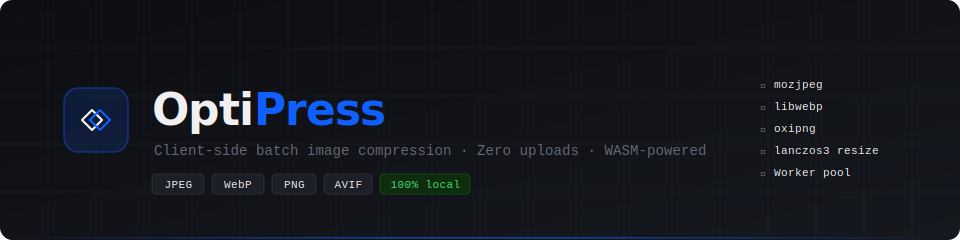

<div align="center">



<br/>

[](./LICENSE)
[](https://vite.dev)
[](https://react.dev)
[](https://www.typescriptlang.org)
[](https://webassembly.org)
[](#privacy)

**OptiPress** is a privacy-first batch image optimizer that runs entirely in your browser.  
All compression is handled by native WebAssembly codecs — your images never leave your machine.

[**Try it →**](#) · [Report a bug](https://github.com/cosmind-rusu/optipress/issues) · [Request a feature](https://github.com/cosmind-rusu/optipress/issues)

</div>

---

## Overview

Most image optimization tools upload your files to a remote server to compress them. OptiPress does the opposite — it ships the *compressor itself* to your browser as WebAssembly, so every byte of your images stays local. This makes it safe for:

- **Corporate environments** with data residency or NDA restrictions
- **Healthcare/legal** workflows where images may contain sensitive content
- **Developers** who want a fast, offline-capable tool without accounts or rate limits

The architecture is intentionally transparent. Open DevTools → Network tab while compressing — you'll see zero upload requests.

---

## Features

| | |
|---|---|
| **Real WASM codecs** | mozjpeg (JPEG), libwebp (WebP), oxipng (PNG), lanczos3 resize — not browser canvas encoding |
| **Parallel compression** | Worker pool sized to your CPU core count (up to 4 workers) for batch throughput |
| **Format conversion** | Convert any input to WebP, JPEG, or PNG on output |
| **Encoder effort tiers** | Fast / Balanced / Best — trades encoding time for file size |
| **Before/after comparison** | Draggable slider to compare original vs compressed visually |
| **ZIP download** | Package all compressed images into a single ZIP with one click |
| **Lanczos3 resize** | Optional max-width downsampling with high-quality resampling |
| **Aggregate stats** | Real-time totals: images done, bytes saved, % reduction |
| **100% offline** | Static deployment, no backend, no tracking, no accounts |

---

## WASM Engine

OptiPress uses the [jSquash](https://github.com/jamsocket/jSquash) family of packages — the maintained successors to Google Squoosh's codec bindings.

```
Input image (any format)
        │
        ▼
   jSquash decoder                     ← mozjpeg-dec / webp-dec / png-dec
   (or OffscreenCanvas fallback)       ← for AVIF, HEIF, BMP, etc.
        │
        ▼
   ImageData (RGBA pixels in memory)
        │
        ├── maxWidth set?
        │       └──► squoosh-resize (lanczos3, linearRGB, premultiplied alpha)
        │
        ▼
   jSquash encoder (in Web Worker)
        │
        ├── image/jpeg  → mozjpeg encode   (trellis quantization, progressive)
        ├── image/webp  → libwebp encode   (method 0–6, sharp_yuv, alpha)
        └── image/png   → png encode
                              └──► oxipng optimise  (level 1–6, lossless)
        │
        ▼
   ArrayBuffer transferred back to main thread (zero-copy)
        │
        ▼
   Blob URL created → preview + download
```

### Encoder effort presets

Each effort tier tunes codec-specific parameters:

| Effort | mozjpeg | libwebp | oxipng |
|--------|---------|---------|--------|
| **Fast** | No trellis, single pass | method 2 | level 1 |
| **Balanced** *(default)* | Trellis enabled, progressive | method 4 | level 3 |
| **Best** | Trellis multipass, optimize tables | method 6 + sharp_yuv | level 6 |

**Best** mode typically produces 15–25% smaller files than **Fast** at the cost of ~5–10× encoding time.

### Worker pool

```
Main Thread
    │
    ├─ submit(job) ──► Worker #1  [encodes image A]
    ├─ submit(job) ──► Worker #2  [encodes image B]
    ├─ submit(job) ──► Worker #3  [encodes image C]
    └─ submit(job) ──► Worker #4  [encodes image D]
                       ▲
                  (idle workers pick up queued jobs)
```

Each worker maintains its own codec instance cache — WASM modules are lazy-loaded on first use and reused for all subsequent jobs, so only the first image of each type incurs an init cost.

---

## Tech Stack

| Layer | Technology | Notes |
|-------|-----------|-------|
| Framework | React 18 + TypeScript 6 | Hooks-driven, no Redux |
| Build | Vite 8 | Native ESM, WASM asset handling |
| Styling | Tailwind CSS 4 | CSS-first config via `@theme` |
| WASM codecs | `@jsquash/*` | mozjpeg, libwebp, oxipng, resize |
| Threading | Web Workers API | Worker pool, Transferable buffers |
| ZIP | `fflate` | ~8 KB, pure JS, no server needed |
| Icons | `lucide-react` | |
| Fonts | Figtree + JetBrains Mono | via Google Fonts |

---

## Getting Started

### Prerequisites

- Node.js 20+
- npm 10+

### Install & run

```bash
git clone https://github.com/cosmind-rusu/optipress.git
cd optipress
npm install
npm run dev
```

Open [http://localhost:5173](http://localhost:5173) in your browser.

> **Note:** The dev server sets `Cross-Origin-Opener-Policy: same-origin` and `Cross-Origin-Embedder-Policy: require-corp` headers. These are required for some WASM codecs that use `SharedArrayBuffer`. If you're using a reverse proxy, ensure these headers are forwarded.

### Build for production

```bash
npm run build
npm run preview   # preview the production build locally
```

The `dist/` folder is a fully self-contained static site. Deploy to Vercel, Netlify, GitHub Pages, or any static host.

### Deploying to Vercel

```bash
vercel --prod
```

Add a `vercel.json` to set the required security headers:

```json
{
  "headers": [
    {
      "source": "/(.*)",
      "headers": [
        { "key": "Cross-Origin-Opener-Policy", "value": "same-origin" },
        { "key": "Cross-Origin-Embedder-Policy", "value": "require-corp" }
      ]
    }
  ]
}
```

---

## Project Structure

```
optipress/
├── public/
│   └── wasm/                   # Static WASM binary overrides (optional)
├── src/
│   ├── components/
│   │   ├── DropZone.tsx         # Drag-and-drop + file input
│   │   ├── Controls.tsx         # Format · Quality · Max width · Effort
│   │   ├── ImageQueue.tsx       # Scrollable list of jobs
│   │   ├── ImageCard.tsx        # Per-image: thumbnail, progress, savings
│   │   ├── BeforeAfterSlider.tsx# Draggable comparison overlay
│   │   ├── StatsBar.tsx         # Aggregate bytes-saved stats
│   │   ├── DownloadButton.tsx   # Single file or ZIP download
│   │   └── PrivacyBadge.tsx     # Privacy explanation popover
│   ├── workers/
│   │   └── compress.worker.ts   # WASM pipeline: decode → resize → encode
│   ├── lib/
│   │   ├── workerPool.ts        # Worker pool with queue + crash recovery
│   │   ├── formats.ts           # Magic-byte format detection + formatBytes
│   │   └── zip.ts               # fflate ZIP wrapper + download trigger
│   ├── hooks/
│   │   └── useImageQueue.ts     # State management, pool dispatch, job lifecycle
│   └── types/
│       └── index.ts             # Shared TypeScript interfaces
├── vite.config.ts
├── index.html
└── package.json
```

---

## Privacy

OptiPress processes images **entirely in your browser**. No image data is ever sent to a server.

- The application is a static bundle — once loaded, it works fully offline
- No analytics, no error reporting, no cookies
- All codec WASM modules are loaded from the same origin as the app
- `ArrayBuffer`s are transferred between threads via `postMessage` with the Transferable interface — they never leave the browser process

**To verify:** Open DevTools → Network tab → compress a batch of images. The only requests will be the initial asset load. No uploads.

---

## Roadmap

- [x] AVIF encoding via `@jsquash/avif`
- [x] Lossless WebP mode toggle
- [x] EXIF/IPTC metadata strip option
- [x] SSIM quality score in the before/after comparison
- [x] PWA manifest + service worker for offline install
- [ ] CLI/npm package for CI pipeline usage (`npx optipress ./images/**`)
- [ ] Custom presets (save quality/format profiles)

---

## Contributing

Pull requests are welcome. For major changes, open an issue first to discuss what you'd like to change.

```bash
# Fork + clone
git clone https://github.com/your-username/optipress.git
cd optipress
npm install

# Create a branch
git checkout -b feature/your-feature

# Make changes, then
npm run build  # ensure it builds without errors
git push origin feature/your-feature
# Open a PR
```

---

## License

Distributed under the **MIT License**. See [`LICENSE`](./LICENSE) for more information.

---

<div align="center">

Built by [Cosmin Rusu](https://github.com/cosmind-rusu)

[](https://github.com/cosmind-rusu)
[](https://linkedin.com/in/cosmind-rusu)

</div>
